# 💻 SitesEveryDay – Personal Portfolio

A personal web presentation for a freelancer and junior PHP developer. The site includes multiple sections, a contact form, dark/light mode toggle, admin area, and a fully customized design.

## 🧠 Features

- Clean and modern design
- Dark / Light mode toggle
- PHP login system for admin
- Contact form with validation
- CSRF token protection
- Tool and framework icons
- Multilingual-ready structure
- Fully responsive (mobile / tablet / desktop)

---

## 📸 Page Previews

|--------------|------------------|-------------|
| 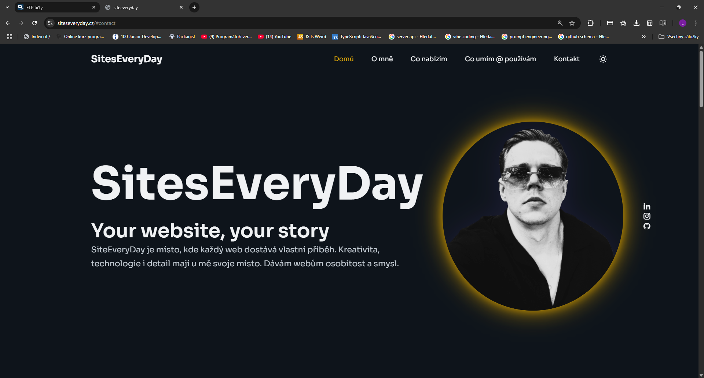 | 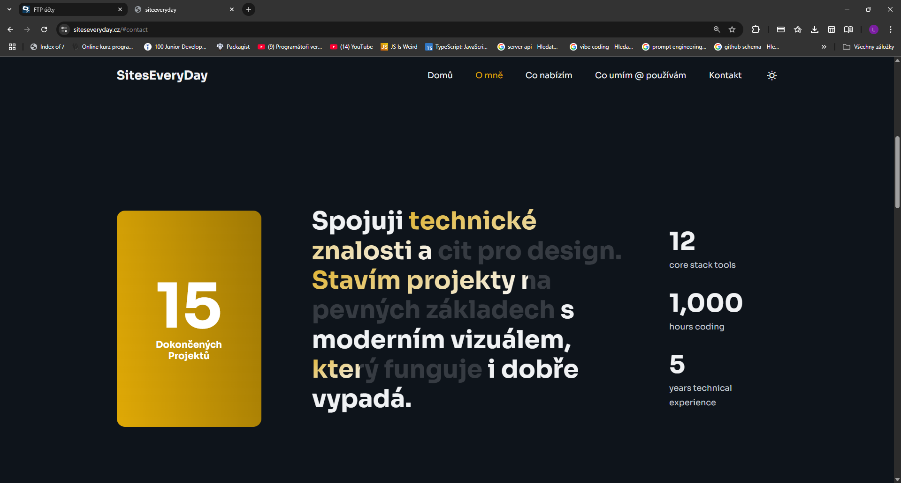 | 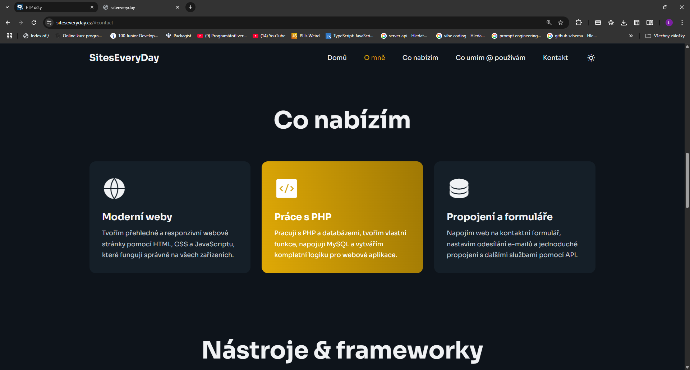 |

|-----------------------------|------------------|----------------------|
| 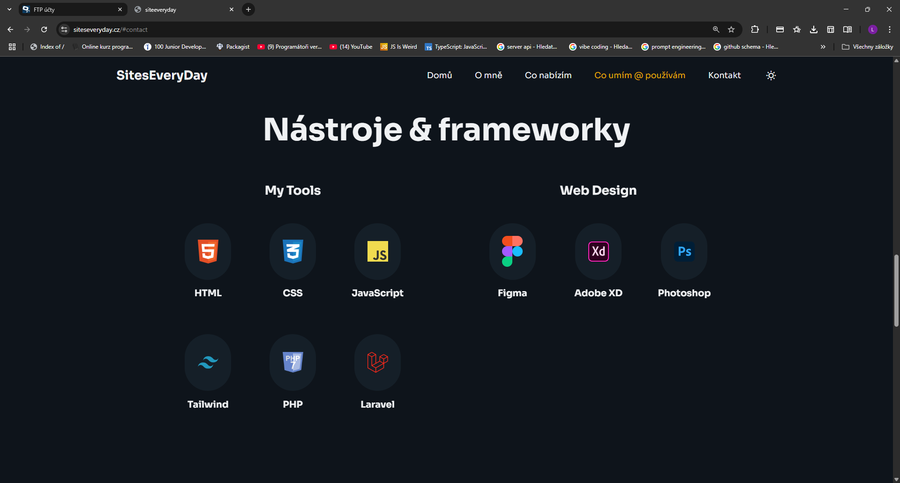 | 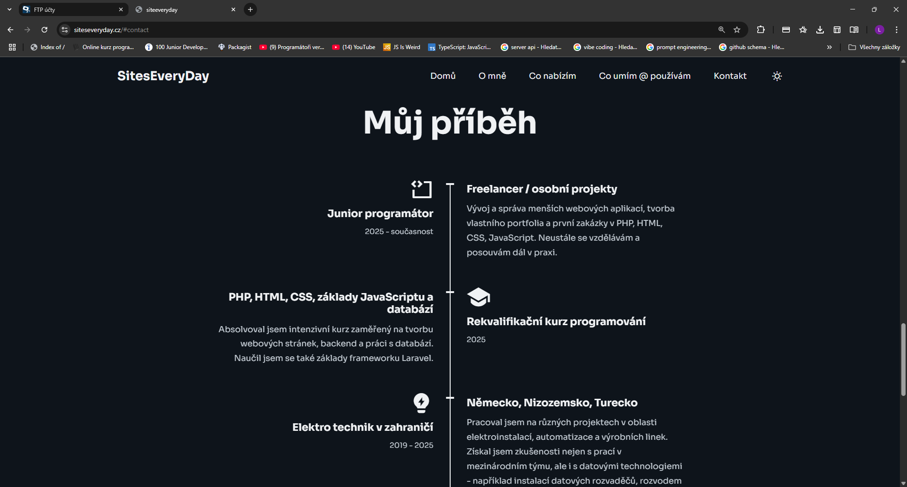 | 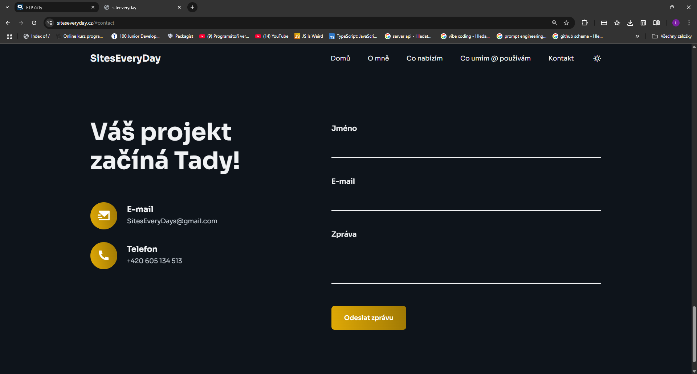 |
                                LightMode/SWITCH 
            |----------------|-------------------|-------------------| 
| 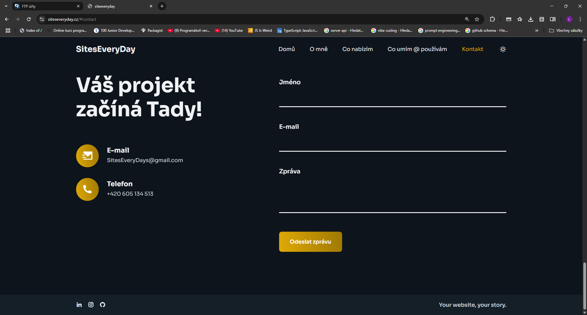 | 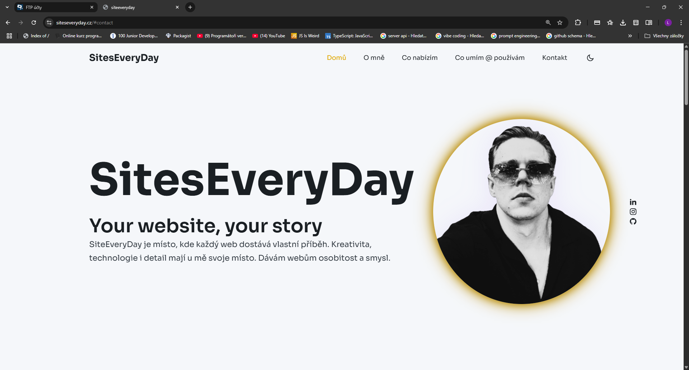 | 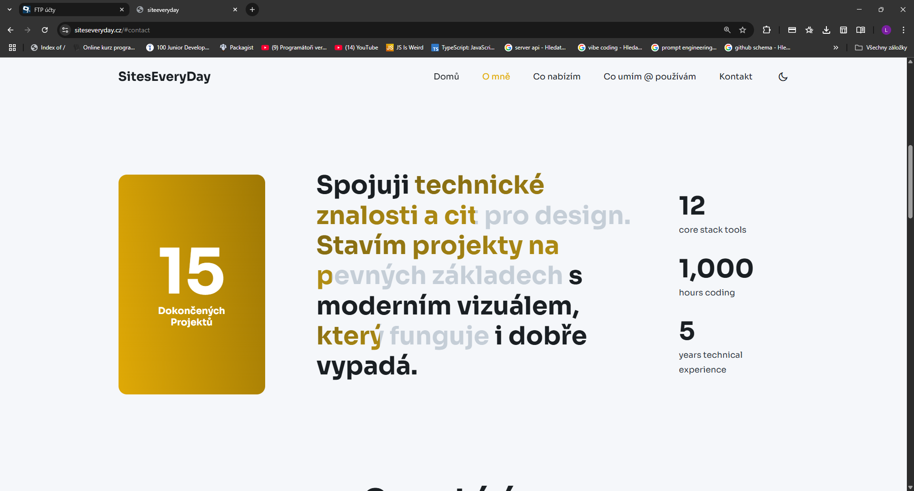 |

|---------------------|------------------|-------------------|
|  | 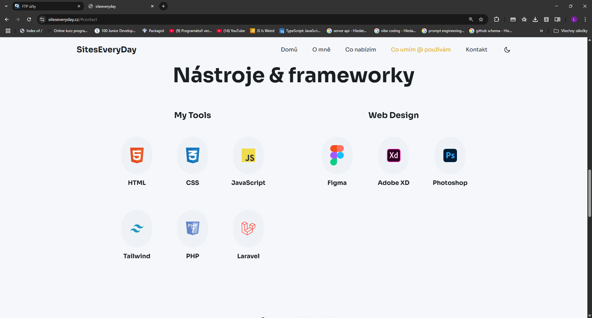 | 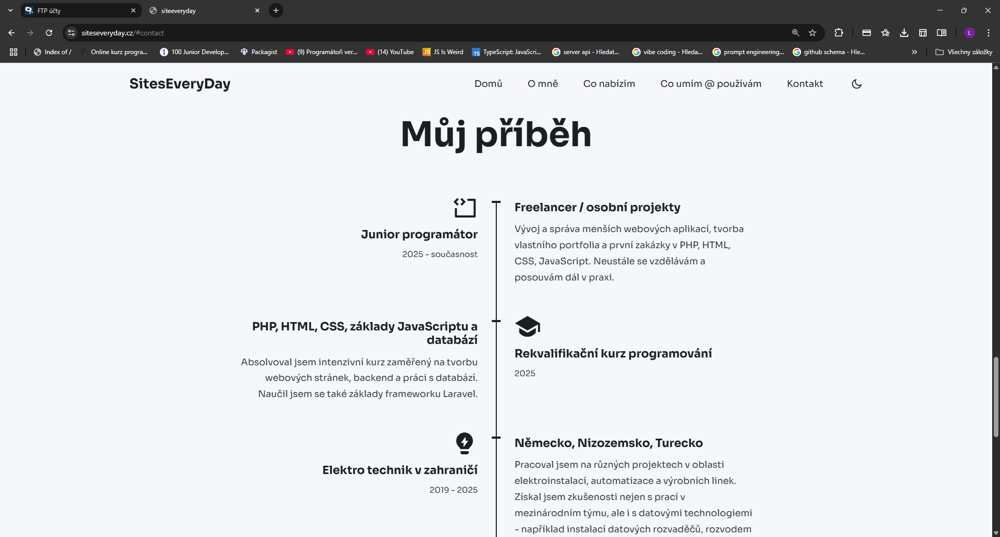 |

|--------------------------|
| 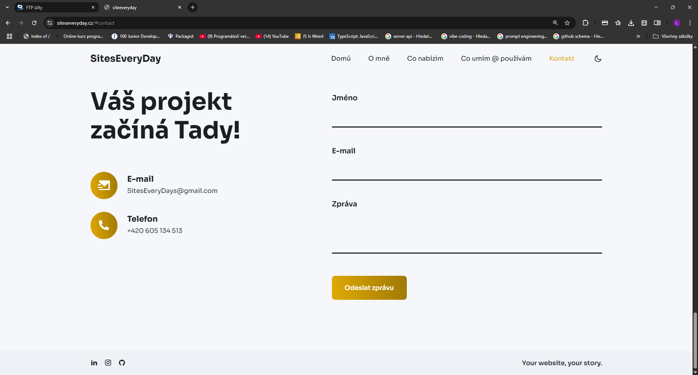 |

---

## 🛠 Technologies Used

- **Frontend:** HTML5, CSS3, JavaScript (vanilla)
- **Backend:** PHP 8
- **Design:** Figma
- **Styling:** Custom CSS, partial Tailwind
- **Database:** MySQL (used in admin panel)
- **Security:** CSRF protection
- **Font:** Sora from Google Fonts

---

## 📁 Project Structure

/
├── index.php
├── admin/
│ └── admin.php
├── assets/
│ ├── css/
│ │ └── style.css
│ ├── js/
│ └── icons/
├── process_message.php
├── .htaccess
├── [1.png to 13.png]

## 🔗 Live Website

Deployed at [https://siteseveryday.cz](https://siteseveryday.cz)

---

## 📬 Contact

- E-mail: SitesEveryDays@gmail.com  
- Phone: +420 605 134 513

---

> *Your website, your story.*

(CZ)
# 💻 SitesEveryDay – Osobní portfolio

Webová prezentace pro freelancera a juniorního PHP developera. Obsahuje více sekcí, kontaktní formulář, přepínání dark/light režimu, administraci a vlastní design.

## 🧠 Funkce

- Moderní čistý design
- Dark / Light režim
- PHP přihlašování do admin sekce
- Kontaktní formulář s validací
- Ochrana pomocí CSRF tokenu
- Ikonky nástrojů a technologií
- Vícejazyčná struktura připravená pro budoucí rozšíření
- Responzivní layout (mobil/tablet/desktop)

---

## 📸 Náhledy stránek

|-----------------------------|------------------|----------------|
|     |  |  |

|--------------------------------|------------------|-----------------|
|        |  |  |
                                LightMode/SWITCH
|---------------------------|----------------------|-------------|
|   |  |  |

|------------------------|--------------------|------------------|
|  |  |  |

|-----------------------------|
|  |

---

## 🛠 Použité technologie

- **Frontend:** HTML5, CSS3, JavaScript 
- **Backend:** PHP 8
- **Design:** Figma
- **Styling:** Vlastní CSS, částečně Tailwind styl
- **Databáze:** MySQL (pouze v admin části)
- **Bezpečnost:** CSRF ochrana
- **Web font:** Sora

---

## 📁 Struktura projektu

/
├── index.php
├── admin/
│ └── admin.php
├── assets/
│ ├── css/
│ │ └── style.css
│ ├── js/
│ └── icons/
├── process_message.php
├── .htaccess
├── [1.png až 13.png]

---

## 🔗 Live verze

Projekt běží na [https://siteseveryday.cz](https://siteseveryday.cz)

---

## 📬 Kontakt

- E-mail: SitesEveryDays@gmail.com  
- Telefon: +420 605 134 513

---

> *Your website, your story.*
